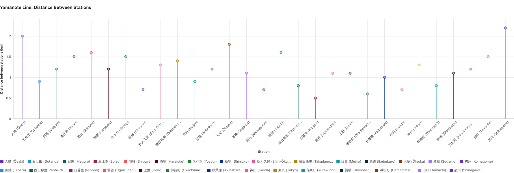

# Yamanote Line Station Dataset

This repository contains a clean, structured dataset of stations along the **Yamanote Line** in Tokyo, Japan — one of the busiest and most iconic urban rail loops in the world. The dataset was compiled as part of a research project exploring data visualisation practices in UX/UI and digital humanities.

## 📊 Preview

## 📂 Dataset Contents

- `data/yamanote_stations.csv`  
  A CSV file listing station names in **Japanese and English**, including:
  
| Column | Description |
|--------|-------------|
| `Station_Japanese` | Station name in Japanese script |
| `Station_English` | Station name in English |
| `Distance_between` | Distance in km from the previous station |
| `Distance_from_Shinagawa` | Cumulative distance in km from **Shinagawa Station** (reference point) |

## 📈 Example Use Case

This dataset is used in a [React-based data visualisation project](https://github.com/MunoMono/rca-phd-website) that leverages **Carbon Design System Charts**, with responsive layouts and animated transitions designed for researchers, designers, and educators.

## 🔍 Source

- **Original source:**  
  [Simple English Wikipedia – Yamanote Line](https://simple.wikipedia.org/wiki/Yamanote_Line)

- Data was scraped using a custom Python script with `BeautifulSoup` and `pandas`.  
  → See [`scripts/yamanote_scraper.py`](scripts/yamanote_scraper.py) for full reproducibility.

## 📖 Citation

If you use this dataset in research, teaching, or visualisation work, please credit: Newman, G.
